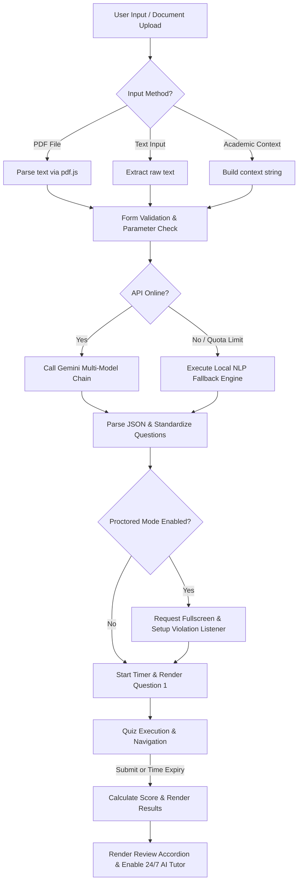

# Quizwee AI - Complete Technical & Feature Documentation

> **Version:** 2.5  
> **Architecture:** 100% Client-Side Static Web Application  
> **AI Engine:** Google Gemini Generative AI (Multi-Model Cascading Chain with Local NLP Fallback)  
> **Design Framework:** Custom Vanilla CSS Design System with Clean, High-Performance Low-Motion UX  

---

## 1. Executive Summary

**Quizwee AI** is a state-of-the-art, web-based intelligent quiz generation and learning assessment platform. Built specifically for students, self-learners, and university educators, Quizwee AI transforms documents (PDFs, text notes) or academic topics into university-grade interactive quizzes.

Key attributes of the project:
* **Zero Backend Server Overhead:** Runs entirely in the user's browser (no Node.js, PHP, or XAMPP required).
* **Multi-Modal Generation:** Supports raw text input, uploaded PDF/TXT source files, and direct Academic Context input (Degree, Branch, Subject, Year).
* **Anti-Cheat Proctoring Protocol:** Includes an integrated fullscreen anti-cheat exam mode with tab-switch detection and a countdown violation timer.
* **Contextual 24/7 AI Tutor:** Post-quiz chatbot assistant that explains mistakes, clarifies question concepts, and simplifies complex academic terms.
* **Calm, High-Legibility Focus:** Optimized for zero cognitive distraction and maximum performance across all mobile and desktop devices.

---

## 2. Exhaustive Feature Matrix

### 📄 2.1 Input & Document Parsing
* **Drag-and-Drop Document Upload:** Supports drag-and-drop or file browser uploads of `.pdf` and `.txt` files with visual dropzone feedback.
* **Client-Side PDF Extraction:** Uses `pdf.js` to parse binary PDF files directly into raw text using ArrayBuffer streams without uploading files to external third-party file servers.
* **Raw Text Parsing:** Accepts direct copy-pasted paragraphs, lecture notes, textbook chapters, or articles up to 15,000 characters.
* **Academic Context Generator:** Generates targeted quizzes directly from structured fields without requiring source files:
  * **Topic / Subject** (e.g., *Data Structures*, *Cybersecurity*, *Organic Chemistry*)
  * **Degree** (e.g., *B.Tech*, *BCA*, *M.Sc*)
  * **Branch / Specialization** (e.g., *Computer Science*, *Electrical*, *Finance*)
  * **Academic Year / Semester** (e.g., *3rd Year / Sem 5*)

---

### ⚙️ 2.2 Flexible Quiz Configuration Parameters
* **Question Count Control:** Generates anywhere from **1 to 100 questions** per quiz session.
* **Time Limit Configuration:** Configurable exam duration from **1 to 180 minutes** with live countdown timer and automatic submit on expiry.
* **Difficulty Levels:**
  * **Easy:** Focuses on core definitions and primary concepts.
  * **Medium:** Standard university difficulty testing key details.
  * **Hard:** Advanced problem-solving and in-depth academic rigor.
* **Question Types:**
  * **Multiple Choice (MCQs):** Standard 4-option questions with choice badges (`A`, `B`, `C`, `D`).
  * **True / False:** 2-option verification questions.
  * **Mixed Mode:** Dynamic balance of MCQs and True/False questions.
* **Focus Area Custom Topics:** Allows specifying specific chapters, formulas, or sub-topics to prioritize during generation.

---

### 🎓 2.3 Special Exam Modes
* **Syllabus Reference Mode (📚):** Optimized for academic curricula. Analyzes modules, units, and learning outcomes in uploaded syllabus documents to ensure balanced question coverage across the entire syllabus scope.
* **Practice Mode:** Provides immediate instant feedback during the quiz. Explains correct/incorrect choices right after an option is selected and provides on-demand hints before answering.
* **Proctored Anti-Cheat Exam Mode (🔒):**
  * Requires entering Fullscreen Mode before starting the exam.
  * Listens for `fullscreenchange` and tab/window focus switch events.
  * Displays a full-viewport centered warning overlay if fullscreen is exited.
  * Triggers a **5-second countdown timer** that automatically submits the quiz if fullscreen is not restored.
* **Shuffle Quiz Mode:** Randomizes both question sequence and option order per question to prevent memorization bias.

---

### 🤖 2.4 Google Gemini Multi-Model Fallback Engine
To guarantee 100% uptime and resilience against API rate limits or network hiccups, Quizwee AI implements a dual-tier generation engine:

1. **Multi-Model API Cascading Chain:**  
   Sequentially attempts API requests across Google Gemini models:
   `gemini-2.5-flash` ➔ `gemini-2.0-flash` ➔ `gemini-3.6-flash` ➔ `gemini-3.5-flash` ➔ `gemini-flash-latest` ➔ `gemini-2.5-pro`
2. **Local Natural Language Processing (NLP) Fallback:**  
   If API quota is exhausted or offline, the app seamlessly switches to `generateQuizLocally()`:
   * Performs regex sentence segmentation (`splitIntoSentences`).
   * Computes word frequency matrices excluding stop-words (`getKeywordCandidates`).
   * Dynamically constructs syntactically sound MCQs and True/False questions with distractor options directly inside JavaScript.

---

### 💬 2.5 Interactive AI Tutor Chat Assistant
* **Post-Quiz Integration:** Appears automatically on the Results Screen.
* **Broad Academic Scope:** Explains specific question mistakes (`why was Q1 wrong?`), general score reviews (`show my mistakes`), or any academic concept/term present in the quiz.
* **Simple Language Engine:** Prompt-engineered to provide 1 to 3 sentence explanations in the simplest, most accessible terms.
* **Local Offline Fallback:** If API connection is unavailable, provides an offline breakdown using `getIncorrectAnswerSummary()`.

---

### 🎨 2.6 Clean, High-Performance & Low-Motion Design System
* **Typography:** Premium Google Fonts combination — **Plus Jakarta Sans** (headings, buttons, UI labels) and **Outfit** (numbers, timer, choice badges).
* **Theme System:** Fully integrated Light and Dark modes with automatic system preference detection and `localStorage` state persistence.
* **Calm Assessment Screen UX:** Fast, distortion-free card transitions (`@keyframes calmFadeIn`) prioritizing legibility and user focus during quiz taking.
* **Responsive Anti-Lag Architecture:** Zero continuous GPU animations or heavy mouse tracking scripts, achieving instant responsiveness and 60fps scrolling on all low-power mobile & desktop devices.

---

## 3. Project File Directory Breakdown

```
Final_Project/
├── index.html          # Main HTML structure, SVG icons, modals, and footer
├── style.css           # Design tokens, themes, calm transitions, mobile rules
├── PROJECT_DOCUMENTATION.md # Comprehensive documentation file
├── js/
│   ├── config.js       # Gemini API credentials & model cascading list
│   ├── quiz-engine.js  # Gemini API caller, local NLP fallback, AI Tutor prompt engine
│   ├── proctor.js      # Fullscreen enforcement, violation listeners, countdown timer
│   ├── ui.js           # Theme manager, form validator, quiz renderer, review accordion
│   └── main.js         # Event bindings, drag-and-drop upload, initialization
```

---

## 4. End-to-End Execution & Data Flow



---

## 5. Deployment & Local Setup Guide

### 🚀 Local Execution (No Server Setup Required)
Since **Quizwee AI** is 100% static client-side web code:
1. Open the project folder in any web browser by double-clicking `index.html`.
2. Alternatively, serve via VS Code **Live Server** extension or run `npx serve .` in the project directory.

### ☁️ Static Hosting Deployment
The repository can be deployed instantly to static hosting providers:
* **GitHub Pages:** Select branch `main` and root directory `/`.
* **Vercel / Netlify:** Import repository and set Build Command to empty (static files).
